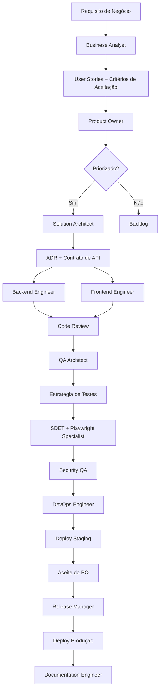

# Workflows: Ciclo de Desenvolvimento

Este documento descreve os fluxos de trabalho padrão da AI Software Factory.

---

## Workflow 1: Nova Feature



### Agentes por Fase

| Fase | Agente Principal | Agentes Suporte | Artefato |
|------|-----------------|----------------|---------|
| Elicitação | Business Analyst | Product Owner | User Stories |
| Arquitetura | Solution Architect | Backend/Frontend | ADR + Contrato API |
| Desenvolvimento | Backend/Frontend Engineer | Code Reviewer | Código + Testes unitários |
| Testes | QA Architect + SDET | Security QA, Performance | Suite de testes |
| Deploy | DevOps Engineer | Docker, Kubernetes | Pipeline + Deploy |
| Documentação | Documentation Engineer | Technical Writer | README + ADR |

---

## Workflow 2: Bug Fix Crítico (Hotfix)

```
1. Incidente detectado (Monitoring Engineer / usuário)
2. Incident Investigator → diagnóstico e impacto
3. Backend/Frontend Engineer → correção
4. Code Reviewer → revisão rápida
5. SDET → teste de regressão mínimo
6. DevOps Engineer → hotfix deploy
7. Release Manager → versão patch (1.2.x)
8. Post-mortem documentado
```

**SLA:** Crítico < 4h | Alto < 24h

---

## Workflow 3: Security Review

```
1. Trigger: PR com mudança em auth/dados sensíveis/infraestrutura
2. Security QA → OWASP Top 10 review
3. Code Reviewer → implementação segura
4. API Test Engineer → testes de autenticação/autorização
5. DevOps → scan de dependências (Snyk/Trivy)
6. Aprovação obrigatória antes do merge
```

---

## Workflow 4: Performance Investigation

```
1. Alerta de degradação (Monitoring Engineer)
2. Performance Engineer → análise de métricas
3. Incident Investigator → correlação de eventos
4. Database Specialist → análise de queries lentas
5. Backend Engineer → otimizações de código
6. Performance Engineer → validação com K6
7. Monitoring Engineer → atualização de dashboards/alertas
```

---

## Workflow 5: Release

```
Checklist de Release:
[ ] Feature freeze (sem novas features na branch)
[ ] Todos os testes automatizados passando
[ ] Testes de regressão completos
[ ] Security scan aprovado
[ ] Performance dentro dos SLAs
[ ] Code review aprovado
[ ] Changelog atualizado
[ ] Versão bumped (SemVer)
[ ] Tag criada no Git
[ ] Deploy em staging validado
[ ] Go/No-Go: Product Owner + Tech Lead
[ ] Deploy em produção (rolling/canary)
[ ] Monitoramento pós-deploy (30 min)
[ ] Comunicação para stakeholders
[ ] Documentação atualizada
```

---

## Checklists Rápidos por Tipo de Mudança

### API Nova
```
[ ] OpenAPI spec definido antes de implementar
[ ] Autenticação e autorização implementadas
[ ] Validação de input em todas as rotas
[ ] Paginação para endpoints de lista
[ ] Tratamento de erros padronizado
[ ] Testes de API cobrindo happy path + erros
[ ] Documentação Swagger atualizada
[ ] Rate limiting configurado
```

### Mudança de Banco de Dados
```
[ ] Migration reversível criada (up + down)
[ ] Testada em staging
[ ] Impacto em queries existentes avaliado
[ ] Índices necessários criados
[ ] Compatibilidade com versão atual em produção
[ ] Backup antes do deploy em produção
```

### Deploy em Produção
```
[ ] Deploy realizado fora do horário de pico
[ ] Health checks passando
[ ] Rollback documentado e testado
[ ] Monitoramento de error rate e latência
[ ] Equipe de suporte informada
[ ] Comunicado para stakeholders (se impacto visível)
```

---

## Workflow 6: Governança de Conteúdo e Catálogo

```
1. Mudança proposta em agents/prompts/checklists/docs
2. Executar suite local: node tools/governance/run-governance.mjs
3. Corrigir divergências detectadas (inventário, paridade, links, frontmatter)
4. Commit com justificativa da mudança estrutural
5. PR com evidência da execução dos checks
6. Workflow CI `.github/workflows/governance-quality.yml` deve passar
7. Aprovação final somente com governança verde
```

**Objetivo:** evitar drift estrutural e manter consistência entre catálogo, prompts e documentação.
